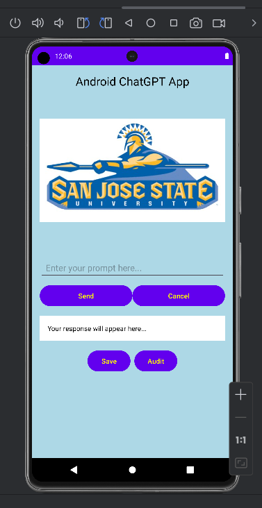
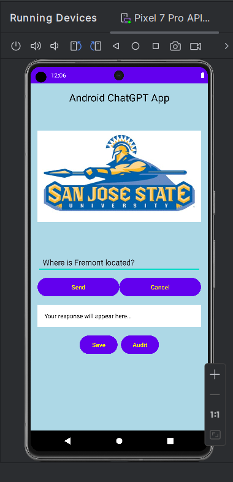
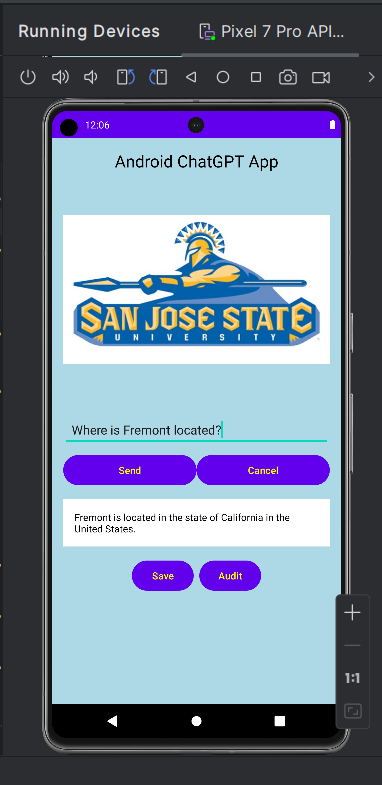
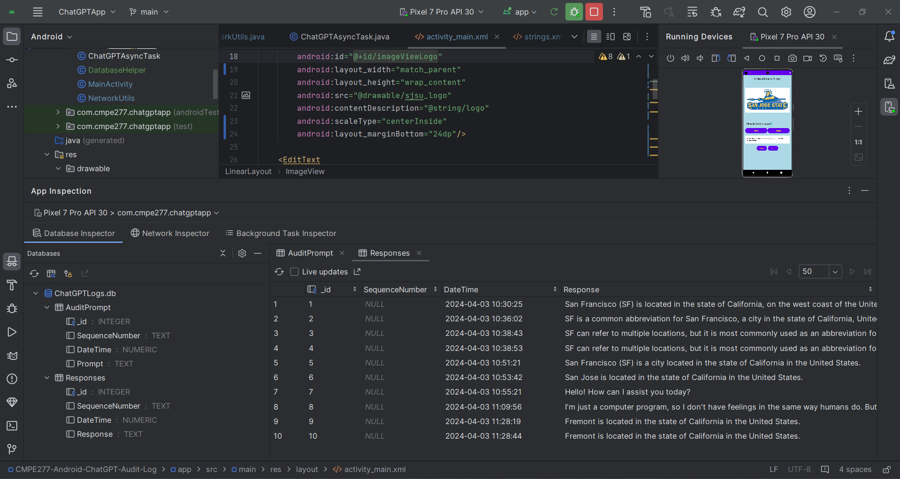
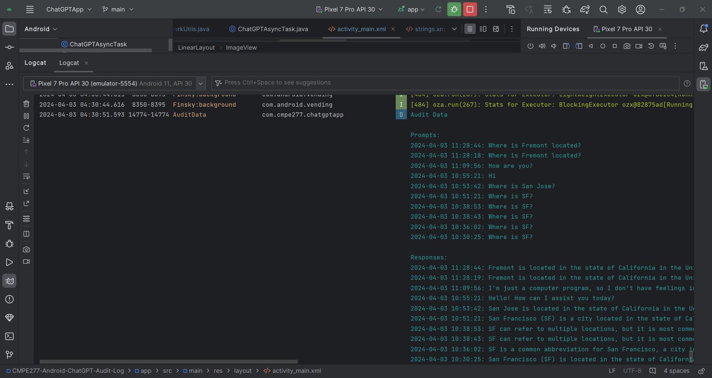

# CMPE277-Android-ChatGPT-Audit-Log
Save Prompt and Responses on Phone for Audit Log purposes.  

*	University Name: http://www.sjsu.edu/
*	Course: CMPE 277 - Smartphone App Dev
*	Professor: [ChandraSekar Vuppalapati](https://www.linkedin.com/in/chandrasekarvuppalapati/)

### Screenshots

Home Screen: ChatGPT App

Entering message in EditText :

On clicking “Send” button, message is sent through ChatGPT API:

On clicking “Save” button, message and response are saved in DB:

On clicking “Audit” button, DB values are fetched and logged into Logcat:

